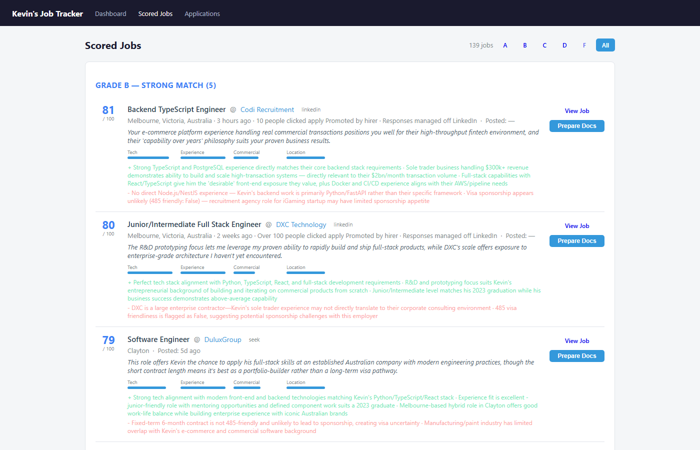
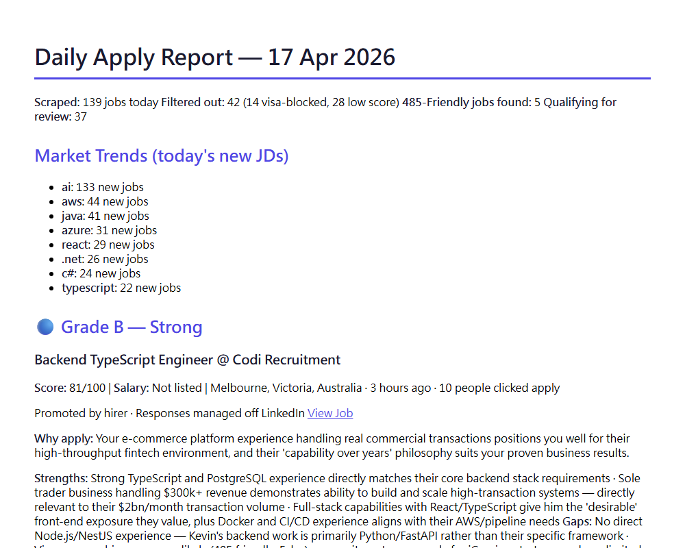
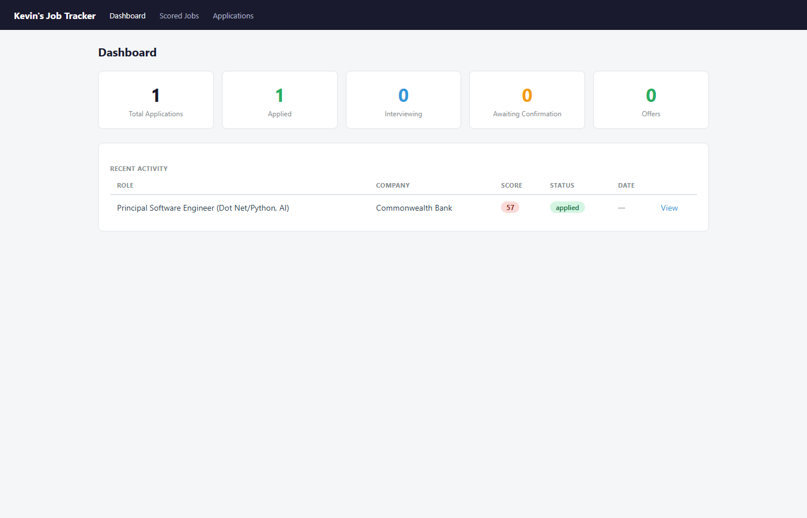

# Job Application Bot

> Autonomous job search pipeline — scrapes LinkedIn & Seek, scores every listing with Claude AI, tailors your resume and cover letter, tracks everything in a dashboard.



---

## How it works

```
┌─────────────────────┐
│   Search            │  Playwright scrapes LinkedIn + Seek
│   LinkedIn + Seek   │  Human-like behaviour, persistent sessions
└────────┬────────────┘
         │ 200+ listings/run
         ▼
┌─────────────────────┐
│   Score             │  Claude AI grades each job A–F
│   Claude AI         │  10 weighted dimensions: tech, seniority,
│                     │  visa, salary, company, culture...
└────────┬────────────┘
         │ ranked shortlist
         ▼
┌─────────────────────┐
│   Dashboard         │  FastAPI web UI — browse, filter by grade,
│   FastAPI           │  review scores, trigger document prep
└────────┬────────────┘
         │ one click
         ▼
┌─────────────────────┐
│   Tailor            │  Claude rewrites your resume + cover letter
│   Claude AI         │  specifically for each job description
└────────┬────────────┘
         │ you review first
         ▼
┌─────────────────────┐
│   Apply             │  Playwright fills the application form,
│   Playwright        │  pauses — you confirm before anything submits
└─────────────────────┘
```

---

## Screenshots

### Scored Jobs Dashboard


### Daily Apply Report



### Overview



---

## Features

| Feature | Detail |
|---------|--------|
| **Multi-source scraping** | LinkedIn + Seek.com.au via Playwright with anti-bot evasion |
| **AI grading** | Claude scores each job 0–100 across 10 dimensions, grades A–F |
| **Smart filtering** | Auto-removes visa-blocked roles, keyword exclusions, low scores |
| **Document tailoring** | Per-job resume + cover letter rewritten by Claude to match the JD |
| **Application dashboard** | FastAPI web UI — browse all scored jobs, filter by grade, one-click prep |
| **Confirmation gate** | Playwright fills the form then pauses — you always review before submit |
| **Daily digest email** | Report emailed every morning with top-ranked jobs |
| **24/7 scheduler** | APScheduler runs search at 7am, digest at 8pm — fully autonomous |
| **Portfolio generation** | Claude designs a matching side project, pushed to GitHub automatically |

---

## Tech Stack

| Layer | Technology |
|-------|-----------|
| Scraping | Playwright (persistent browser context, slow_mo, human delays) |
| AI | Anthropic Claude API (`claude-opus-4-5`) |
| Backend | FastAPI + SQLAlchemy + SQLite |
| Frontend | Jinja2 templates |
| PDF generation | xhtml2pdf |
| Scheduling | APScheduler |
| Notifications | smtplib / Gmail SMTP |
| Portfolio | GitHub REST API |
| CLI | Click |

---

## Project Structure

```
job-application-bot/
├── main.py                  # CLI entry point (click)
├── config.py                # Settings via pydantic-settings + .env
├── preferences.yaml         # Job titles, locations, keywords, salary
│
├── search/
│   ├── base.py              # BaseScraper — human-like helpers (gradual scroll, mouse move)
│   ├── linkedin.py          # LinkedIn Playwright scraper
│   ├── seek.py              # Seek.com.au Playwright scraper
│   └── aggregator.py        # Orchestrates scrapers, deduplicates, saves to DB
│
├── match/
│   ├── scorer.py            # Claude: score + grade each job (10 dimensions)
│   └── reporter.py          # Generate daily markdown report + email digest
│
├── tailor/
│   ├── resume.py            # Claude: rewrite resume for role → PDF
│   └── cover_letter.py      # Claude: write cover letter → PDF
│
├── apply/
│   ├── linkedin.py          # Playwright: fill LinkedIn Easy Apply
│   └── seek.py              # Playwright: fill Seek application form
│
├── dashboard/
│   ├── app.py               # FastAPI routes
│   ├── static/style.css
│   └── templates/           # Jinja2 HTML pages
│
├── notify/
│   ├── emailer.py           # Gmail SMTP
│   └── templates/           # HTML email templates
│
├── portfolio/
│   ├── generator.py         # Claude: design + generate project code
│   └── github_pusher.py     # GitHub REST API: create repo + push files
│
└── scheduler/
    └── jobs.py              # APScheduler daily jobs
```

---

## Scoring System

Each job is scored 0–100 across 10 weighted dimensions:

- Tech stack alignment
- Seniority / experience level fit
- Location (on-site / hybrid / remote)
- Visa eligibility (485, TSS, PR requirement)
- Salary range
- Company quality & growth potential
- Commercial domain fit
- Role clarity
- Culture signals
- Career progression opportunity

| Grade | Score | Action |
|-------|-------|--------|
| A | 85–100 | Apply today |
| B | 70–84 | Strong match |
| C | 50–69 | Worth considering |
| D | 35–49 | Weak match |
| F | < 35 | Auto-filtered out |

Visa-blocked roles (citizenship / PR required) are flagged and excluded. 485-friendly roles are highlighted.

---

## Setup

### 1. Install dependencies

```bash
pip install -r requirements.txt
playwright install chromium
```

### 2. Configure secrets

```bash
cp .env.example .env
# Fill in: ANTHROPIC_API_KEY, GMAIL_APP_PASSWORD, GITHUB_TOKEN, etc.
```

### 3. Set your preferences

Edit `preferences.yaml` — job titles, locations, salary minimum, excluded keywords.

### 4. Add your resume

```
assets/resume_base.md   ← your master resume in Markdown
```

### 5. Login to LinkedIn

```bash
python main.py login linkedin
# Browser opens — log in manually, press Enter when done
```

### 6. Run

```bash
# Full pipeline: search → score → report
python main.py run

# Start the dashboard
python main.py dashboard
# → http://localhost:8001

# 24/7 scheduled mode
python main.py scheduler
```

---

## CLI Reference

| Command | Description |
|---------|-------------|
| `python main.py run` | Full pipeline: search → score → report |
| `python main.py search-only` | Scrape only, no scoring |
| `python main.py report` | Regenerate today's report from DB |
| `python main.py prepare <job_id>` | Tailor resume + cover letter for a specific job |
| `python main.py dashboard` | Start web dashboard (http://localhost:8001) |
| `python main.py scheduler` | Start 24/7 scheduled runner |
| `python main.py login linkedin` | Save LinkedIn session interactively |
| `python main.py digest` | Trigger daily digest email manually |

---

## Key Design Decisions

- **No auto-submit** — the bot always pauses before submitting. You review every application.
- **Human-like scraping** — gradual scrolling, randomised mouse movement, `slow_mo=50`, persistent browser sessions to avoid bot detection.
- **Secrets excluded** — `.env`, `playwright_data/`, `job_tracker.db`, and resume files are all gitignored.
- **Windows compatible** — xhtml2pdf instead of WeasyPrint; UTF-8 stdout configured at startup.
